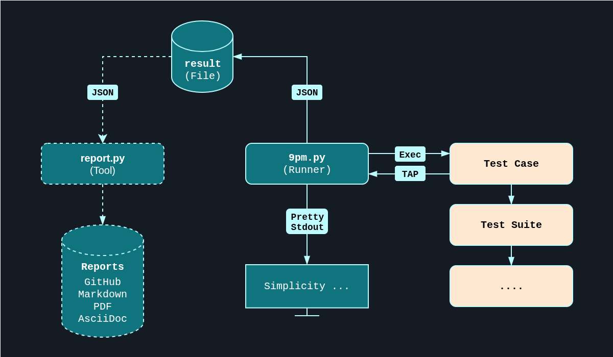

**9pm runs tests in any language without the bloat.** No frameworks to learn, **no exotic dependencies** - just **reliable test execution** and **clear results**.

---

## Why 9pm

- **Universal**: Runs any executable - shell scripts, Python, Perl, compiled binaries
- **TAP Protocol**: Handles results from anything that outputs Test Anything Protocol
- **Crash Detection**: Detects and handles tests that crash mid-execution
- **Flexible Execution**: Run individual tests from command line or organized test suites
- **Nested Structure**: Supports complex hierarchical suites with custom options and names
- **Ready Environment**: Provides temporary directories, logging paths, and clean isolation

*Make complex test setups easy while keeping simple tests simple.*

---

## Overview



---

## Installation

1. Clone the repository:
   ```bash
   git clone <repository-url>
   cd 9pm
   ```
2. Install core dependencies:
   ```bash
   # Debian/Ubuntu
   sudo apt install python3-yaml

   # RHEL/Fedora/CentOS
   sudo dnf install python3-pyyaml
   ```

> [!NOTE]
> This is all you need to run tests and export JSON results. For report generation, see the [Report Generation](#report-generation) section below.

---

## Usage

Run the framework with:
```bash
./9pm.py [OPTIONS] SUITE | TEST ...
```

### Harness Command-Line Options

| Option           | Description                                          |
|------------------|------------------------------------------------------|
| `-a, --abort`    | Stop execution after the first failure.              |
| `-v, --verbose`  | Enable verbose output.                               |
| `-p, --proj`     | Specify an explicit project configuration.           |

### Test Case Command-Line Options (Passed to Test Cases)

| Option           | Description                                          |
|------------------|------------------------------------------------------|
| `-c, --config`   | Test Case config.                                    |
| `-d, --debug`    | Enable test case debug.                              |
| `-o, --option`   | Test case options (repeatable).                      |

Example:
```bash
./9pm.py -o "ssh" suites/main.yaml cases/cleanup.sh
```

---

## Writing Test Suites

Test suites are YAML files that organize individual test cases or reference nested suites. Test cases must be executable files.

### Simple Test Suite Example
```yaml
- case: "tests/smoke.sh"
- case: "tests/hammer.pl"
- case: "tests/cleanup.py"
```

### Nested Test Suite Example

```yaml
- case: "tests/smoke.sh"
- case: "tests/unit_test.tcl"
- suite: "suites/integration.yaml"
  name: "Integration-Tests"
- suite: "suites/regression.yaml"
  name: "Regression-Tests"
```

### Option Naming
Name can be used effectivly when passing different options to the same test case.


```yaml
- case: "tests/scp.sh"
  opts:
    - "192.168.1.1"
    - "bootloader.bin"
  name: "upload-bootloader"
- case: "tests/scp.sh"
  opts:
    - "192.168.1.1"
    - "linux.sqfs"
  name: "upload-os"
```
Resulting in the following:
```
o Execution
|-- o 0001-upload-bootloader
`-- o 0002-upload-os.sh
```

## Report Generation

9pm exports test results as JSON by default. Additional report formats can be generated using the `report.py` tool.

### JSON Export (Always Available)

Every test run generates a comprehensive `result.json` file containing:
- Test metadata and timestamps
- Complete hierarchical test structure
- Embedded test output logs
- Summary statistics

### Optional Report Formats

Install additional dependencies for report generation:

```bash
# For PDF reports
gem install --user-install asciidoctor-pdf rouge

# On Debian/Ubuntu
sudo apt install ruby-asciidoctor-pdf ruby-rouge
```

Generate reports from JSON:

```bash
# Generate specific format
python3 report.py result.json github     # -> result-gh.md
python3 report.py result.json markdown   # -> result.md
python3 report.py result.json asciidoc   # -> report.adoc

# Generate all formats
python3 report.py result.json all

# Generate PDF from AsciiDoc
make report  # Generates report.pdf
```

### Report Formats

1. **GitHub Markdown** (`result-gh.md`): GitHub-compatible with emoji status indicators
2. **Plain Markdown** (`result.md`): Simple markdown format
3. **AsciiDoc** (`report.adoc`): Comprehensive report with embedded test logs
4. **PDF** (`report.pdf`): Professional report generated from AsciiDoc

### GitHub Emoji Legend

| Status          | Emoji                  |
|------------------|------------------------|
| Passed           | `:white_check_mark:`  |
| Failed           | `:red_circle:`        |
| Skipped          | `:large_orange_diamond:` |
| Masked Failure   | `:o:`                 |
| Masked Skip      | `:small_orange_diamond:` |

---

## Logging and Environment

- **Logs**: Stored in timestamped directories under the configured `LOG_PATH`. A symlink `last` points to the latest log directory.
- **Scratch Directory**: Temporary directories are created for each test run and cleaned up automatically.
- **Temporary Database File**: A temporary database file is used during the test lifecycle.

---

## Writing Test Cases

Tests must output results in [TAP (Test Anything Protocol)](https://testanything.org/) format.

### Example Test Case

```bash
#!/bin/bash
echo "1..1"
echo "ok 1 - Sample test case"
```

---

## License

This project is licensed under GPL-2.0 license. For contributions or issues, open a pull request or issue on GitHub.
